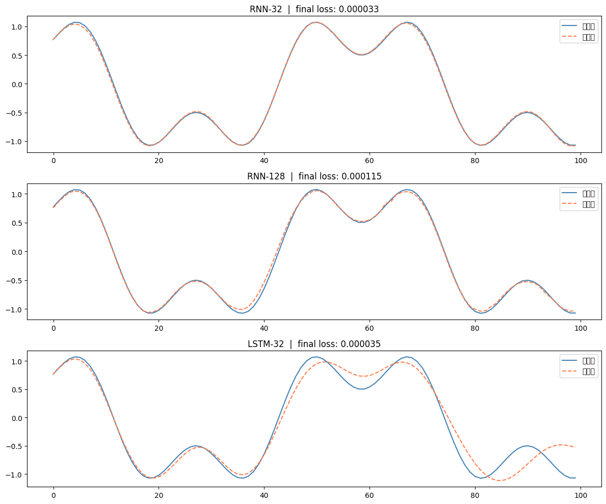
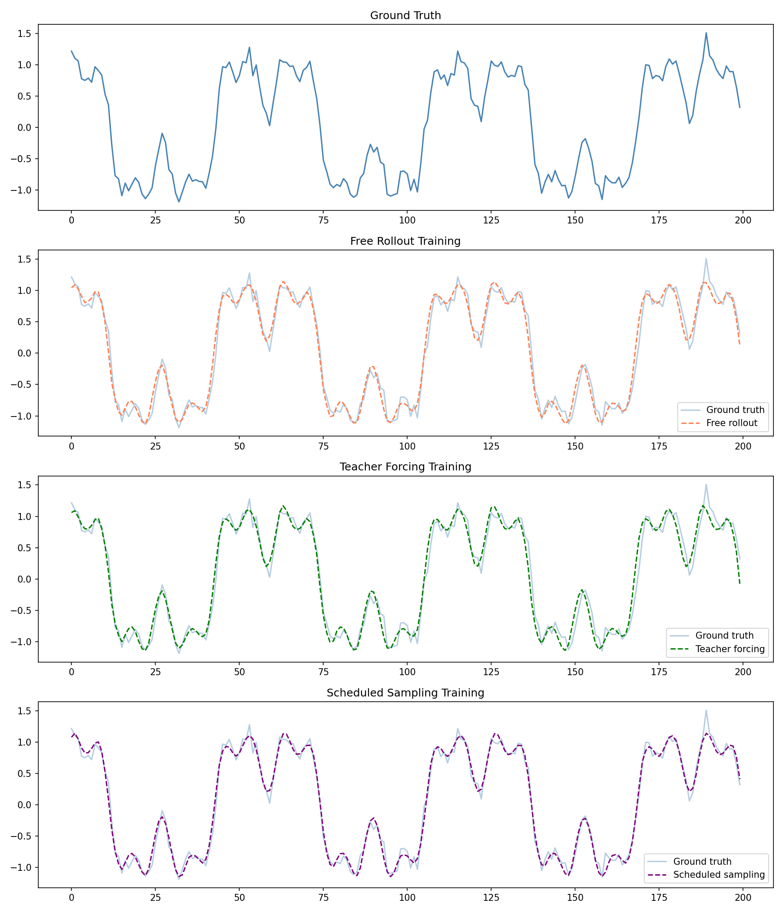
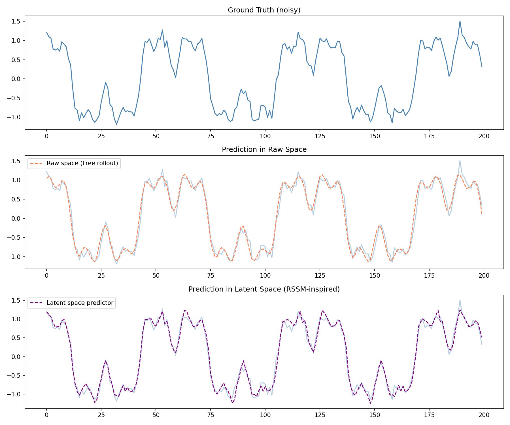
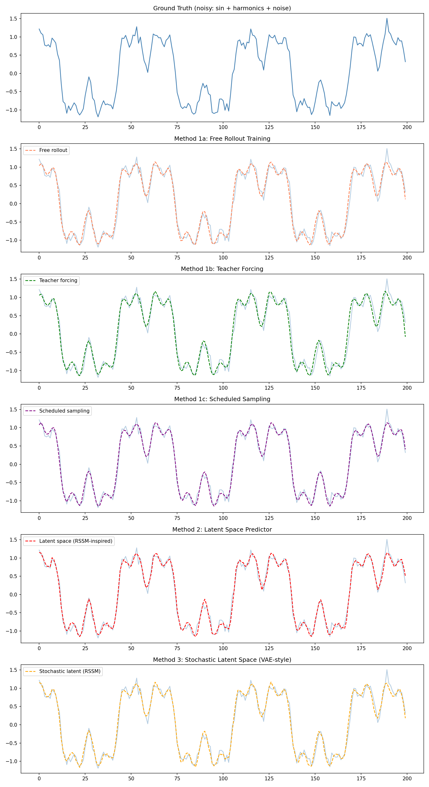
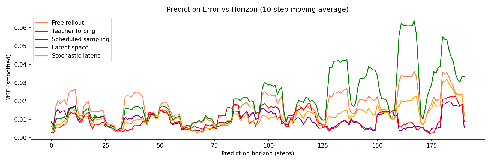

# Sequence Prediction: From LSTM to RSSM

A progressive exploration of long-horizon sequence prediction,
starting from a vanilla LSTM and building toward the core architecture
of world models (RSSM / Dreamer).

## What this project does

Predicts a noisy composite signal (`sin(t) + 0.5·sin(3t) + 0.3·sin(7t) + noise`)
using autoregressive rollout — feeding each prediction back as the next input.
Each method addresses a limitation of the previous one, tracing the design
decisions that motivate RSSM.

## Methods

**Part 1: Architecture comparison**
Trained RNN-32, RNN-128, and LSTM-32 on a clean dual-frequency signal.
More parameters (RNN-128) did not help. LSTM-32 consistently outperformed
despite having fewer parameters than RNN-128, demonstrating that architecture
design matters more than capacity.



**Part 2: Training strategies**
Three strategies compared on the harder noisy signal:

- Free rollout: standard training, model never sees its own predictions
- Teacher forcing: ground truth fed at every step during training
- Scheduled sampling: gradually transitions from teacher forcing to free rollout

Key finding: on a capable model (LSTM), all three strategies converge on this
signal. Differences emerge under longer horizons and higher noise.



**Part 3: Latent space predictor (RSSM-inspired)**
Instead of predicting in raw value space, an encoder compresses each timestep
into a 16-dim latent vector. The LSTM predicts the next latent state, and a
decoder reconstructs the output.

Gradient clipping was essential to stabilise training. Without it, the model
collapsed to predicting the mean — a common failure mode in encoder-decoder
architectures.



**Part 4: Stochastic latent space (VAE-style)**
The encoder now outputs a distribution (mu, sigma) rather than a fixed vector.
Each prediction samples from this distribution via the reparameterization trick,
allowing the model to express uncertainty. Trained with reconstruction loss and
KL divergence, completing the VAE-style design central to RSSM.



## Results summary

| Method | Rollout stability | Captures noise | Uncertainty |
|--------|------------------|----------------|-------------|
| Free rollout | moderate | partial | no |
| Teacher forcing | high | yes | no |
| Scheduled sampling | high | yes | no |
| Latent predictor | high | yes | no |
| Stochastic latent | high | yes | yes |



Teacher forcing shows the highest long-horizon error despite low training loss,
confirming train-test mismatch. Latent space methods maintain the lowest error
across all horizons.

| Method | Mean MSE (all) | Mean MSE (last 50) |
|--------|---------------|--------------------|
| Free rollout | 0.01676 | 0.02204
| Teacher forcing | 0.02147 | 0.03815
| Scheduled sampling | 0.00953 | 0.00938
| Latent space | 0.00978 | 0.01095
| Stochastic latent | 0.01151 | 0.01720

## How to run

```
pip install torch numpy matplotlib
python training_strategies_and_latent.py
```

## Connection to world models

This project implements a simplified version of the RSSM used in DreamerV3
(Hafner et al., 2023). The full RSSM adds: action conditioning, multi-step
imagination rollouts, and a separate actor-critic trained entirely in latent
space. The stochastic latent predictor here is the direct predecessor to that
architecture.
